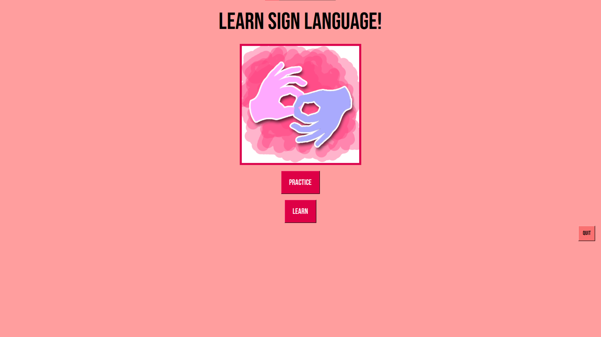
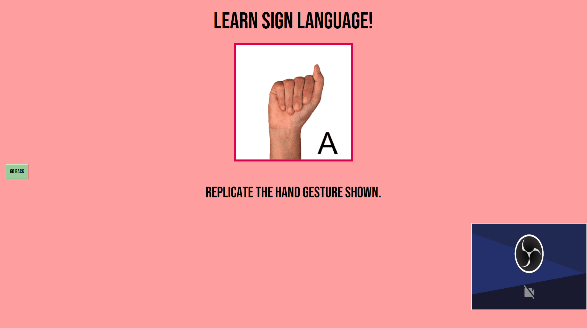

# Sign-Language-Educator
A software made for teaching people sign language through an interactive interface where AI is used to detect and correct your sign language


## Preview

 
 

---

## How It Works

**Used:** Python, Tkinter, OpenCV, MediaPipe Hands, scikit-learn, Pillow

* **ML classifier** – a pickled scikit-learn model (`model/model.p`) converts the 42 landmark into one of **A-Z**
* **Two learning modes** –  
  * **Learn**: Go trhough alphabetically through example cards  
  * **Practice**: A Random letter challenge  
* **Hints & feedback** – one-click *HINT* overlays the correct pose and “Good Job!” text pops after a correct sign.  

---

## What I learned

* First exposure to training AI models by hand using Python
* How to use OpenCV and MediaPipe


---


## Getting Started 🏃‍♂️

```bash
# 1 – Clone
git clone https://github.com/Umar-Ansari-X/Sign-Language-Educator.git
cd Sign-Language-Educator

# 2 – Install libs
pip install opencv-python mediapipe scikit-learn pillow numpy

# 3 – Run
python Project.py
